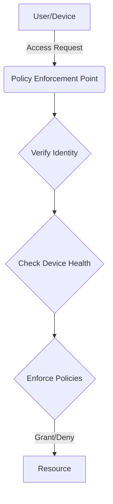

The traditional security model of a strong perimeter with a trusted internal network ("castle and moat") is no longer effective in a world of cloud services, remote work, and sophisticated attackers. Zero Trust is a modern security paradigm based on a simple but powerful principle: **never trust, always verify**.

This means that no user or device is trusted by default, regardless of whether they are inside or outside the corporate network. Every access request must be authenticated, authorized, and encrypted before being granted.

The core principles of Zero Trust are:
1.  **Verify Explicitly**: Always authenticate and authorize based on all available data points, including user identity, location, device health, and service.
2.  **Use Least Privilege Access**: Grant users only the access they need to perform their job, for the shortest time necessary.
3.  **Assume Breach**: Segment networks, encrypt all communications, and monitor activity to minimize the "blast radius" if an attacker does get in.

Implementing Zero Trust is a journey, not a destination. It involves a shift in mindset and a gradual adoption of technologies like multi-factor authentication (MFA), identity and access management (IAM), and micro-segmentation.
